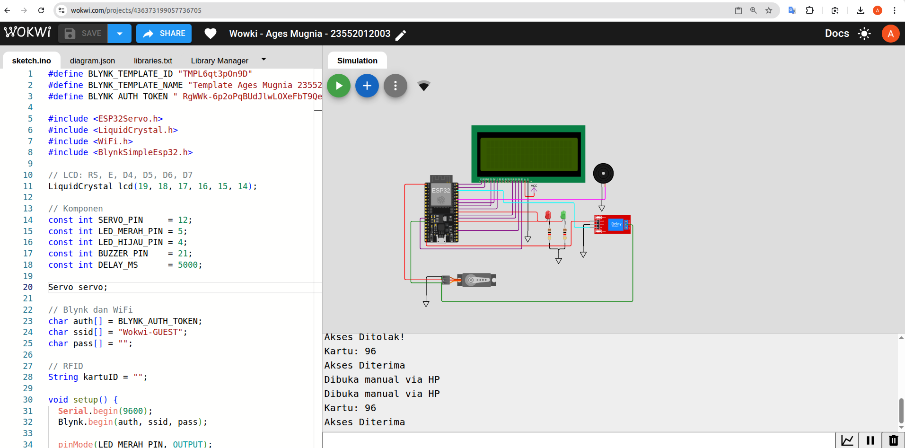
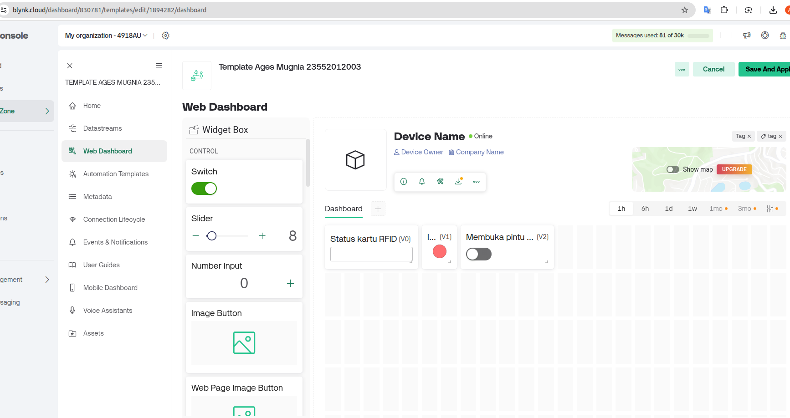

# Sistem Pengunci Pintu Otomatis Berbasis RFID dan Blynk

Proyek ini merupakan sistem keamanan berbasis mikrokontroler (ESP32) yang memungkinkan pengguna membuka pintu secara otomatis menggunakan kartu RFID dan aplikasi Blynk dari smartphone.

---

## Alat & Bahan
- Aplikasi Blynk
- Wokwi (untuk simulasi)

---

## Fitur Sistem

- Autentikasi menggunakan RFID
- Kontrol pintu melalui aplikasi Blynk
- Tampilan status pada LCD (akses diterima/ditolak)
- Indikator suara (buzzer) dan cahaya (LED)
- Dapat diakses dan dikontrol secara jarak jauh

---

## Rangkaian (Wiring Diagram)



---

## Tampilan Aplikasi Blynk



---

## Cara Kerja

1. Pengguna menempelkan kartu RFID ke reader.
2. Sistem mengecek UID kartu:
   - Jika UID terdaftar → servo membuka pintu, LED hijau menyala, buzzer bunyi singkat, LCD menampilkan "Akses Diterima".
   - Jika UID tidak dikenal → servo tetap tertutup, LED merah menyala, buzzer bunyi panjang, LCD menampilkan "Akses Ditolak".
3. Pengguna juga dapat membuka pintu melalui tombol pada aplikasi Blynk.
4. Semua status ditampilkan secara real-time.

---

## Kode Program Wowki

```cpp
#define BLYNK_TEMPLATE_ID "TMPL6qt3pOn9D"
#define BLYNK_TEMPLATE_NAME "Template Ages Mugnia 23552012003"
#define BLYNK_AUTH_TOKEN "_RgWWk-6p2oPqBUdJlwLOXeFbT9QekpT"

#include <ESP32Servo.h>
#include <LiquidCrystal.h>
#include <WiFi.h>
#include <BlynkSimpleEsp32.h>

// LCD: RS, E, D4, D5, D6, D7
LiquidCrystal lcd(19, 18, 17, 16, 15, 14);

// Komponen
const int SERVO_PIN     = 12;
const int LED_MERAH_PIN = 5;
const int LED_HIJAU_PIN = 4;
const int BUZZER_PIN    = 21;
const int DELAY_MS      = 5000;

Servo servo;

// Blynk dan WiFi
char auth[] = BLYNK_AUTH_TOKEN;
char ssid[] = "Wokwi-GUEST";
char pass[] = "";

// RFID
String kartuID = "";

void setup() {
  Serial.begin(9600);
  Blynk.begin(auth, ssid, pass);

  pinMode(LED_MERAH_PIN, OUTPUT);
  pinMode(LED_HIJAU_PIN, OUTPUT);
  pinMode(BUZZER_PIN, OUTPUT);

  servo.attach(SERVO_PIN);
  servo.write(90); // Terkunci

  lcd.begin(20, 4);
  tampilkanJudul();
  Serial.println("Siap. Scan kartu RFID Anda.");
}

void loop() {
  Blynk.run();
  bacaKartu();
}

void bacaKartu() {
  while (Serial.available()) {
    char ch = Serial.read();

    if (ch == '\n') {  // Enter ditekan
      kartuID.trim(); // hapus spasi/enter
      Serial.println("Kartu: " + kartuID);

      if (kartuID.equals("96")) {
        aksesDiterima("AGES");
      } else {
        aksesDitolak();
      }

      kartuID = ""; // reset
    } else {
      kartuID += ch;
    }
  }
}

void aksesDiterima(const String& nama) {
  Serial.println("Akses Diterima");
  tampilkanAkses("VALID", nama);
  digitalWrite(LED_HIJAU_PIN, HIGH);
  servo.write(0);

  Blynk.logEvent("kartu_valid", "Kartu Valid: " + nama);
  Blynk.virtualWrite(V0, "Diterima: " + nama);
  Blynk.virtualWrite(V1, 1);

  delay(DELAY_MS);
  kunciPintu();
}

void aksesDitolak() {
  Serial.println("Akses Ditolak!");
  tampilkanAkses("INVALID", "UNKNOWN");
  digitalWrite(LED_MERAH_PIN, HIGH);
  digitalWrite(BUZZER_PIN, HIGH);

  Blynk.logEvent("kartu_invalid", "Kartu Tidak Valid");
  Blynk.virtualWrite(V0, "Kartu Tidak Dikenali");
  Blynk.virtualWrite(V1, 0);

  delay(DELAY_MS);
  digitalWrite(LED_MERAH_PIN, LOW);
  digitalWrite(BUZZER_PIN, LOW);
  resetTampilan();
}

void tampilkanJudul() {
  lcd.clear();
  lcd.setCursor(0, 0); lcd.print("SISTEM PINTU OTOMATIS");
  lcd.setCursor(0, 1); lcd.print("Scan kartu RFID Anda");
  lcd.setCursor(0, 2); lcd.print("KARTU :");
  lcd.setCursor(0, 3); lcd.print("NAMA  :");
}

void tampilkanAkses(String status, String nama) {
  lcd.setCursor(8, 2); lcd.print(status + "    ");
  lcd.setCursor(8, 3); lcd.print(nama + "    ");
}

void resetTampilan() {
  lcd.setCursor(8, 2); lcd.print("           ");
  lcd.setCursor(8, 3); lcd.print("           ");
}

void kunciPintu() {
  servo.write(90);
  digitalWrite(LED_HIJAU_PIN, LOW);
  resetTampilan();
}

BLYNK_WRITE(V2) {
  if (param.asInt() == 1) {
    Serial.println("Dibuka manual via HP");
    lcd.setCursor(0, 2); lcd.print("BUKA MANUAL VIA APP");
    lcd.setCursor(0, 3); lcd.print("                   ");

    digitalWrite(LED_HIJAU_PIN, HIGH);
    servo.write(0);

    Blynk.logEvent("manual_open", "Pintu dibuka dari app");
    Blynk.virtualWrite(V0, "Pintu dibuka manual");

    delay(DELAY_MS);
    kunciPintu();
  }
}
```

## Link Proyek

- Simulasi Wokwi: https://wokwi.com/projects/436373199057736705
- Video Demo: https://www.youtube.com/watch?v=TD-x4z1ajxc 

---

## Kontributor

- Nama: **Ages Mugnia**  
- NIM: **23552012003**  
- Kelas: **TIF-K 22 CID**

---

## Lisensi

Proyek ini menggunakan lisensi **MIT**.